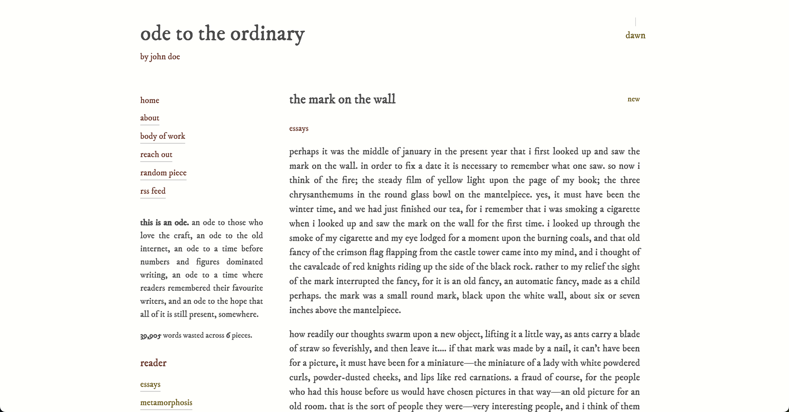
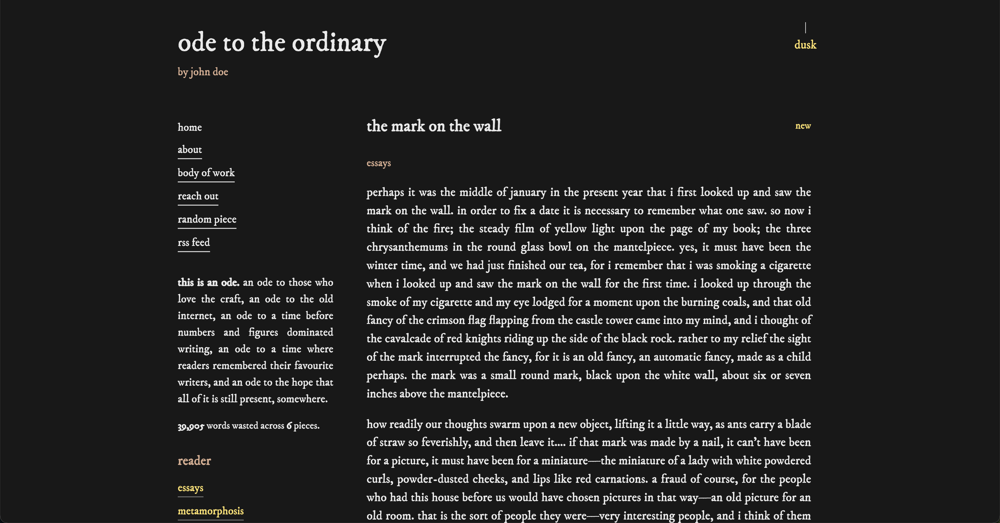
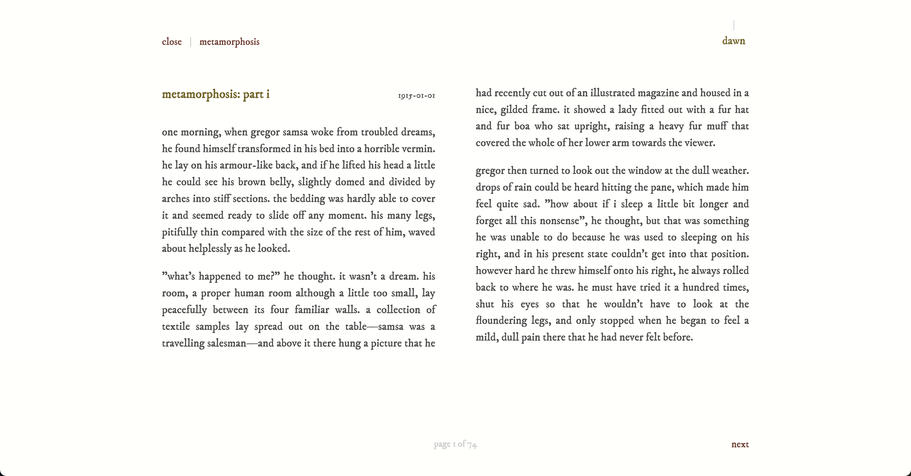
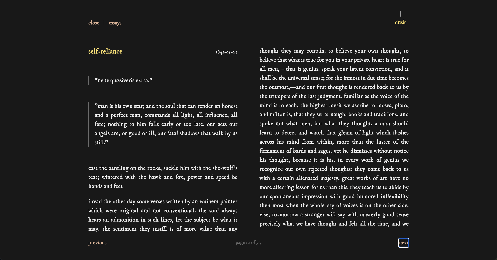
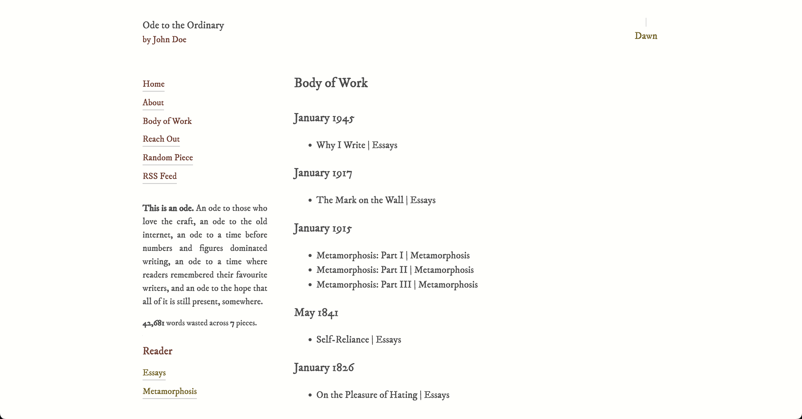
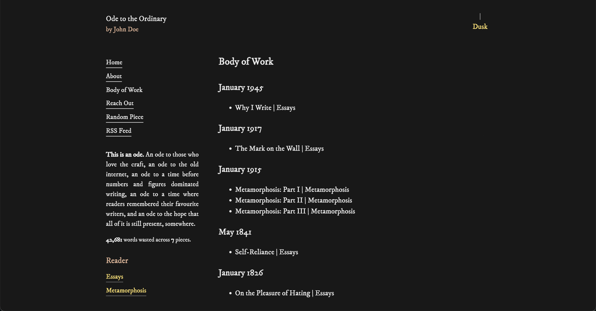

[](https://github.com/DeepanshKhurana/ode/actions/workflows/publish.yml)

# Ode

> An ode to those who love the craft, an ode to the old internet, an ode to a time before numbers and figures dominated writing, an ode to a time where readers remembered their favourite writers, and an ode to the hope that all of it is still present, somewhere.

Ode is for writers who want to publish in an aesthetically pleasing website, who ignore the bells and whistles of the modern internet, and who want to create a better experience for their readers. It is opinionated, minimal, and easy to use, guided by its own [ethos](https://github.com/DeepanshKhurana/ode/blob/main/ETHOS.md).

## Inspiration

The theme/idea comes directly from `journal.coffee` which was my Wordpress-based website where I've written prose for years now. Its styling and design evolved with significant manual effort over the years. Wordpress was great but it became quite bloated over the years and I wanted a lightweight, faster place to write in. Plus, the reading mode and ease of markdown publishing has been on my mind for ages.

Rest assured, as of the very first release, I am using `ode` too!

> [!WARNING]  
> Like all good things, Ode is currently changing and evolving. Things might break now and then.

## Live Demo

You can find a live demo of the app [here](https://ode-demo.vercel.app/).

## Documentation

- **[README.md](https://github.com/DeepanshKhurana/ode/blob/main/README.md)**: Overview, features, and getting started
- **[ETHOS.md](https://github.com/DeepanshKhurana/ode/blob/main/ETHOS.md)**: Core principles and philosophy behind Ode
- **[WRITING.md](https://github.com/DeepanshKhurana/ode/blob/main/WRITING.md)**: Content repository, auto-deployment, and GitHub Actions
- **[THEMING.md](https://github.com/DeepanshKhurana/ode/blob/main/THEMING.md)**: Theme presets, customization, local fonts, and visual examples
- **[CHANGELOG.md](https://github.com/DeepanshKhurana/ode/blob/main/CHANGELOG.md)**: Version history and release notes
- **[REFERENCES.md](https://github.com/DeepanshKhurana/ode/blob/main/REFERENCES.md)**: Credits and inspirations

## Screenshots

> [!NOTE]  
> For theme-specific screenshots, see [THEMING.md](https://github.com/DeepanshKhurana/ode/blob/main/THEMING.md)

<table>
  <tr>
    <td width="50%">
      
    </td>
    <td width="50%">
      
    </td>
  </tr>
  <tr>
    <td width="50%">
      
    </td>
    <td width="50%">
      
    </td>
  </tr>
  <tr>
    <td width="50%">
      
    </td>
    <td width="50%">
      
    </td>
  </tr>
</table>

### Lamp Demo with Sound

This is my favourite feature, personally.

https://github.com/user-attachments/assets/222af674-11f0-4b5a-8232-a31aca8a61b1

## Features

- **Markdown-based content**: Write your pieces and pages in simple markdown files with front matter; push to publish
- **Reader mode**: Beautiful paginated reading experience with keyboard navigation (arrow keys)
  - **Checkpointing:** URLs for the reader mode track piece and position so even if you publish more and the collection gets updated, a bookmarked link will always send the reader to the right place in the "book"
  - **Gestures:** The Reader supports both swipe and trackpad gestures
- **Collections/Volumes**: Automatically organize your pieces into themed collections for curated reading
- **Dark/Light mode**: Automatic theme switching with user preference persistence with a nice lamp reminiscent of olden times
- **Theming**: 10 built-in themes with full customization support via `config.yaml`
- **RSS feed**: Auto-generated RSS feed with full content for your readers to use
- **Body of Work**: Chronological archive of all your pieces, organized by month/year; order is up to you
- **Random piece**: Let readers discover content serendipitously and the continue reading
- **Build-time generation**: Static pages and indexes generated during build for optimal performance
- **Fully customizable**: All UI labels, site metadata, and page order configurable via `config.yaml`
- **No tracking, no analytics, no boxes, no search, no media**: Just writing and reading

## Getting Started

> [!TIP]
> For detailed notes on how to setup a **content repository** with sync, look into the [WRITING.md](https://github.com/DeepanshKhurana/ode/blob/main/WRITING.md)

### Docker Compose (Recommended)

If you want to self-host, use the public Docker image. Create a directory with your content:

```
my-site/
  public/
    config.yaml
    content/
      intro.md
      pieces/
      pages/
  docker-compose.yml
```

Create a `docker-compose.yml`:

```yaml
services:
  ode:
    image: ghcr.io/deepanshkhurana/ode:latest
    ports:
      - "8080:4173"
    restart: unless-stopped
    volumes:
      - /path/to/your/public:/app/public
```

> [!TIP]  
> Use an absolute path for the volume mount (e.g., `/home/user/my-site/public`). Relative paths may not work correctly with tools like Portainer.

Run:

```bash
docker compose up -d
```

Your site will be available at `http://localhost:8080`. Restart the container to rebuild after content changes:

```bash
docker compose restart
```

### Other Deployment Options

> [!NOTE]  
> In this case, you need to replace the content in `public/` with your own.

Once you have your Fork or branch ready, you can deploy the app but the reader position Permalinks as well as the Body of Work links will fail. This is due to SPA handling of paths and (from my understanding) how React works. But this can be fixed.

#### Deploy to Vercel

You can directly to Vercel below. `vercel.json` already has the fixes Vercel will need.

https://github.com/DeepanshKhurana/ode/blob/46873b31df3d4b02bbb375d4389173a1b6ac3f6b/vercel.json#L1-L12

[](https://vercel.com/new/clone?repository-url=https%3A%2F%2Fgithub.com%2FDeepanshKhurana%2Fode)

#### nginx Configuration

If you are like me, you probably have your own server where you will need to handle SPA routing. If you are using nginx, a template is already provided.

https://github.com/DeepanshKhurana/ode/blob/81c9c2916c5fade480a017b277be7eb1dc799cb4/nginx-template#L1-L32

### From WordPress

If you are coming from WordPress, you can use the awesome [lonekorean/wordpress-export-to-markdown](https://github.com/lonekorean/wordpress-export-to-markdown) to get your content in markdown format. It will mostly be plug and play with this version of Ode.

## Writing Content

> [!TIP]
> A longer guide is in [WRITING.md](https://github.com/DeepanshKhurana/ode/blob/main/WRITING.md)

### Pieces

Create markdown files in `public/content/pieces/` with front matter:

```markdown
---
title: "Your Piece Title"
slug: "your-piece-slug"
date: 2025-11-23
categories:
  - essays
  - fiction
---

Write to your heart's desire.
```

### Pages

Create markdown files in `public/content/pages/` with front matter:

```markdown
---
title: "About"
slug: "about"
date: 2021-06-14
---

Tell everyone everything!
```

## Theming

> [!NOTE]  
> For complete theming documentation, including all available presets, customization options, and local font support, see [THEMING.md](https://github.com/DeepanshKhurana/ode/blob/main/THEMING.md)

Ode comes with 10 built-in themes that you can use and customize. Switch between presets, override colors and fonts, or build your own theme from scratch.

## Configuration

Edit `public/config.yaml` to customize your site. You can handle quite a few things here:

- Change your site's name, author, and vibe at the top.
- Tweak button text and messages to sound how you want.
- Pick which pages show up first in the menu.
- Hide any pages or pieces you don't want public.
- Choose your not found (404) page (yes, a markdown file!).
- Set how collections are sorted—oldest first or newest first.
- Set how the Body of Work page sorts your history.
- Rename the light/dark mode switches.
- Edit the "words wasted" summary to your liking.
- Control the number of entries in the RSS feed.
- Select theme presets and control overrides.

https://github.com/DeepanshKhurana/ode/blob/fcc6d2b7b0b825e07cc07e94a43596e716dd8b79/public/config.yaml#L1-L49

## Development

### Installation

```bash
npm install
```

### Dev Server

```bash
npm run dev
```

Runs the app in development mode at `http://localhost:5173`

### Building

```bash
npm run build
```

This will:
1. Index all pieces from `public/content/pieces/`
2. Index all pages from `public/content/pages/`
3. Paginate pieces for reader mode
4. Calculate word/piece statistics
5. Generate RSS feed
6. Generate body of work archive
7. Build the production bundle

### Preview Production Build

```bash
npm run preview
```

### Build Scripts

Run individual build scripts:

- `npm run build:pieces` - Index pieces
- `npm run build:pages` - Index pages
- `npm run build:paginate` - Paginate pieces
- `npm run build:stats` - Calculate statistics
- `npm run build:rss` - Generate RSS feed
- `npm run build:sitemap` - Generate Sitemap

## Tech Stack

- **React 19** with React Router for client-side navigation
- **Vite** for blazing fast development and optimized builds
- **SCSS** for styling with a clean, minimal design
- **TypeScript** build scripts for content indexing and generation
- **ReactMarkdown** for rendering markdown content
- **Front Matter** for parsing markdown metadata

## License

MIT

## Contributing

You are free to use this, break it, customise it. If you have any idea the community will benefit from, raise a PR or an Issue.
