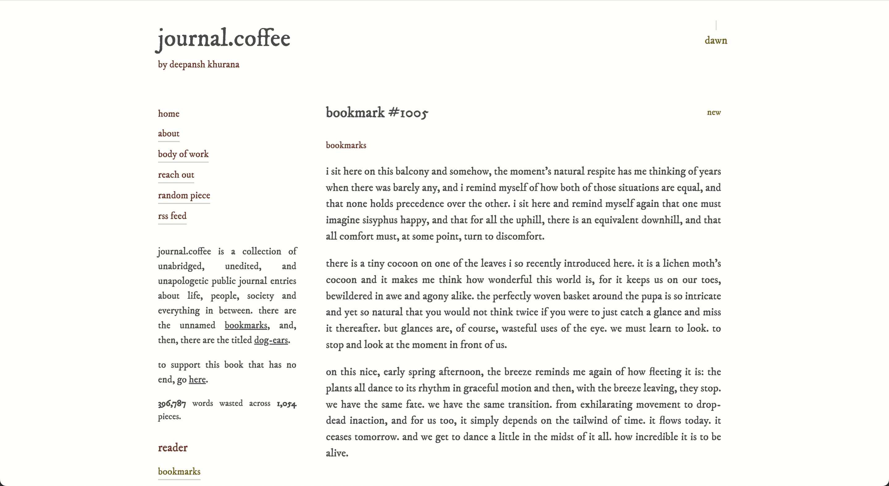
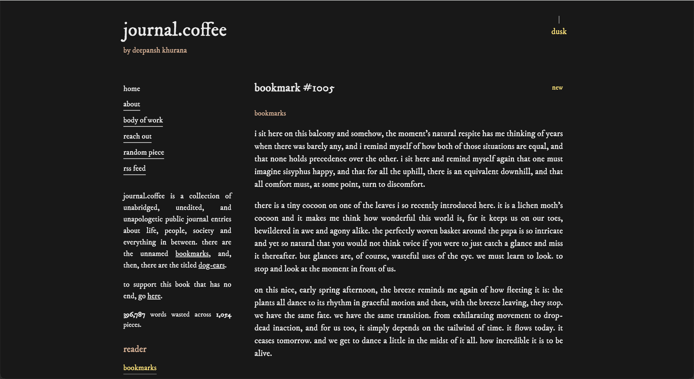
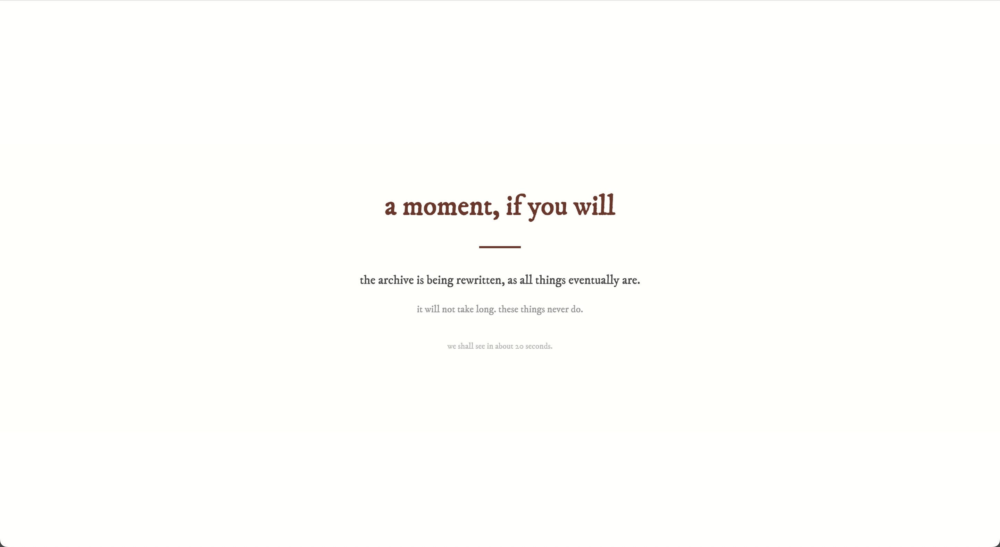
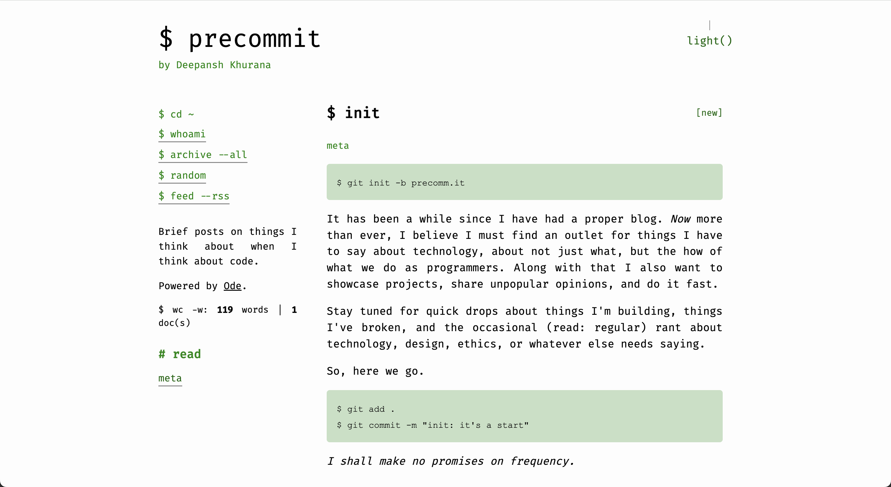
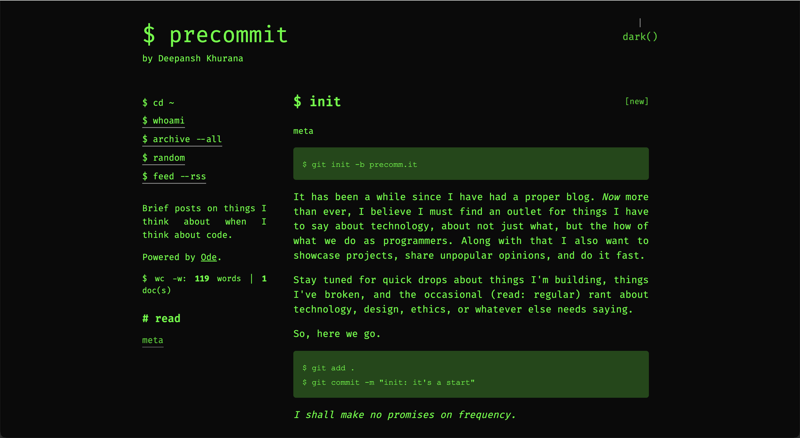
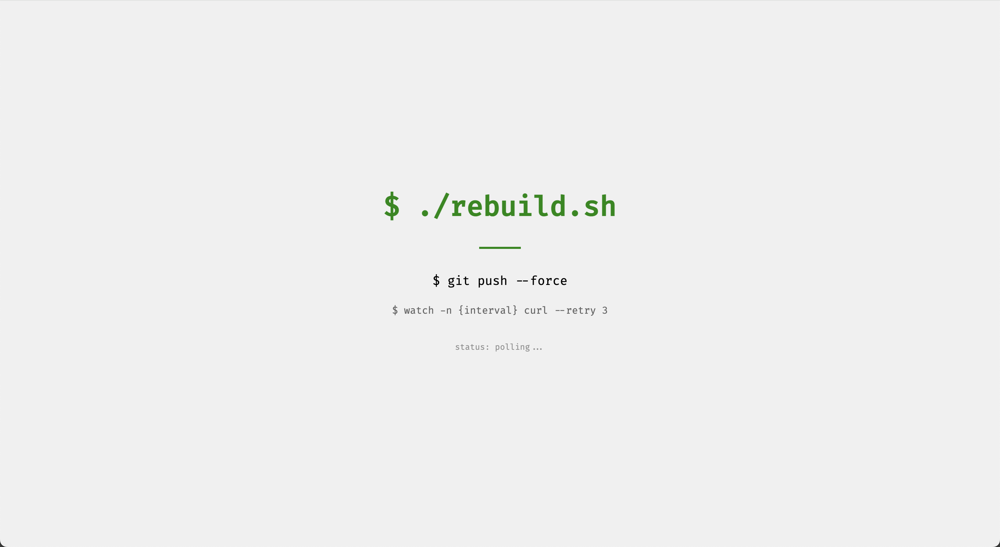

# Showcase

A curated collection of Ode instances in the wild. These are real-world examples of writers and creators using Ode to publish their work.

## Featured

### journal.coffee

[Visit](https://journal.coffee)

The never-ending archive of prose by Deepansh Khurana. The original reason Ode was even built and the inspiration behind the default `journal` theme.

### precomm.it

[Visit](https://precomm.it)

The maintainer and owner's alter-ego showcasing dev notes, thoughts on software and technology among other things.

---

## Adding Your Instance

Want to be featured here? Open a pull request on [GitHub](https://github.com/diwmitlabs/ode/) or send an email to [deepanshkhurana [at] outlook [dot] com](mailto:deepanshkhurana@outlook.com).

**Please include:** `light.png`, `dark.png`, `loader.png` and a text description
