# Theming in Ode

Ode supports themes. I wanted to make sure that reading experiences could vary based on what you're reading, or just your mood. You can switch between presets, customize them partially, or build your own theme from scratch with overrides!

## Available Presets

Ode comes with 10 built-in themes, each is named and carefully designed after a thing you can create. I feel these will fit most people's requirements from the get-go.

- **almanac** - Earthy greens with Lora
- **blueprint** - Technical blue with IBM Plex Sans
- **comic** - Bold comic book style with Lilita One
- **doodle** - Vibrant purple doodles with Amatic SC
- **exploit** - Terminal green on black with Fira Code monospace
- **journal** - Classic literary aesthetic with IM Fell DW Pica
- **manuscript** - Publishing aesthetic with Literata
- **recipe** - Handwritten cooking vibes with Indie Flower
- **scripture** - Warm sepia tones with Crimson Text
- **sketch** - Monochrome pencil aesthetic with Klee One

<table>
  <tr>
    <td width="50%">
      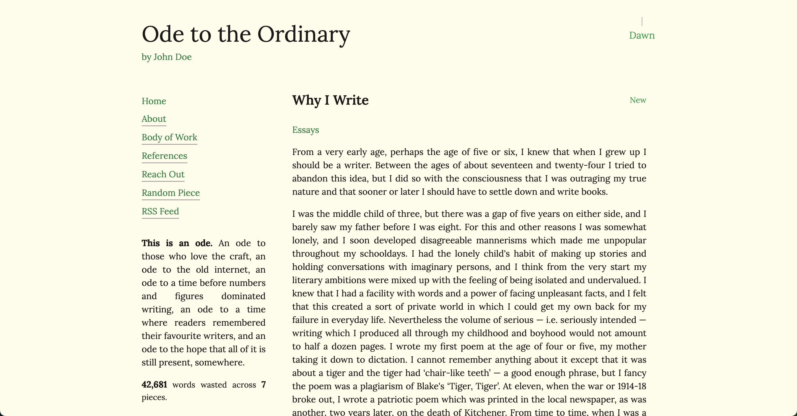
      <p align="center"><strong>almanac</strong> - light</p>
    </td>
    <td width="50%">
      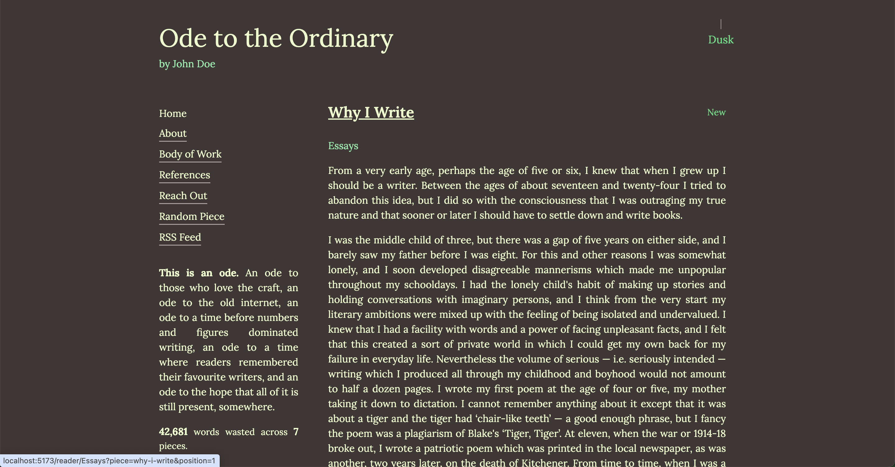
      <p align="center"><strong>almanac</strong> - dark</p>
    </td>
  </tr>
  <tr>
    <td width="50%">
      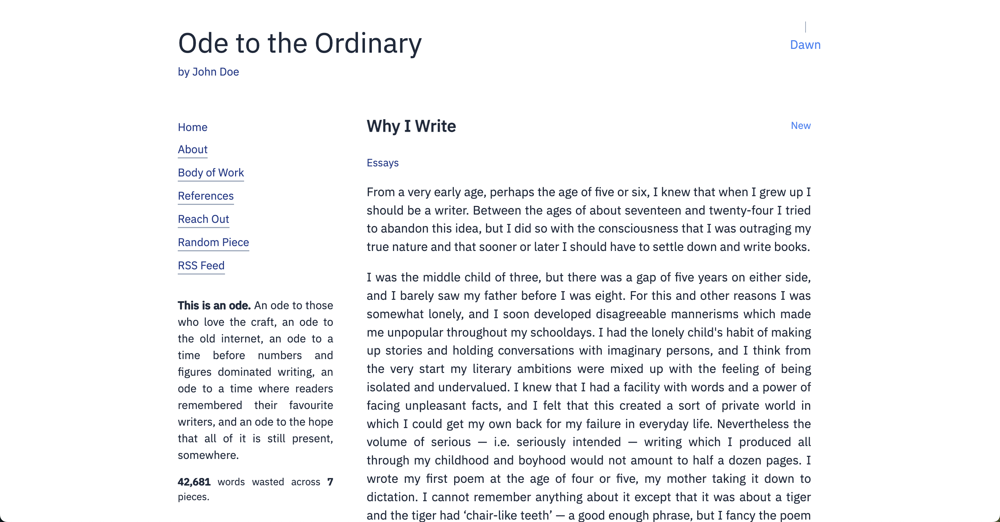
      <p align="center"><strong>blueprint</strong> - light</p>
    </td>
    <td width="50%">
      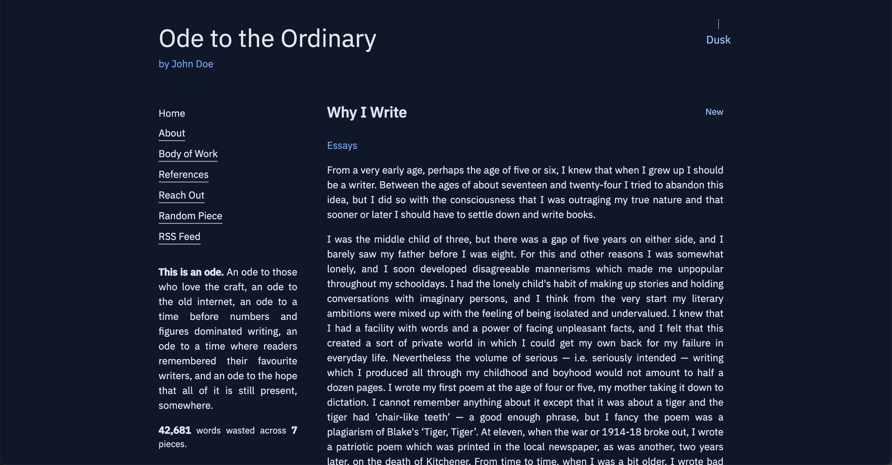
      <p align="center"><strong>blueprint</strong> - dark</p>
    </td>
  </tr>
  <tr>
    <td width="50%">
      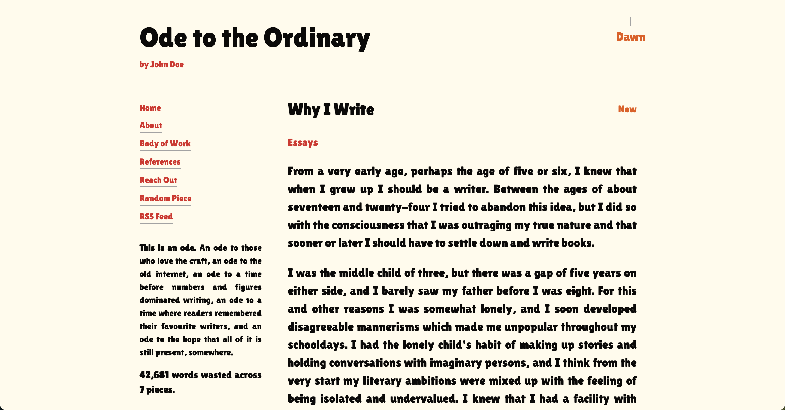
      <p align="center"><strong>comic</strong> - light</p>
    </td>
    <td width="50%">
      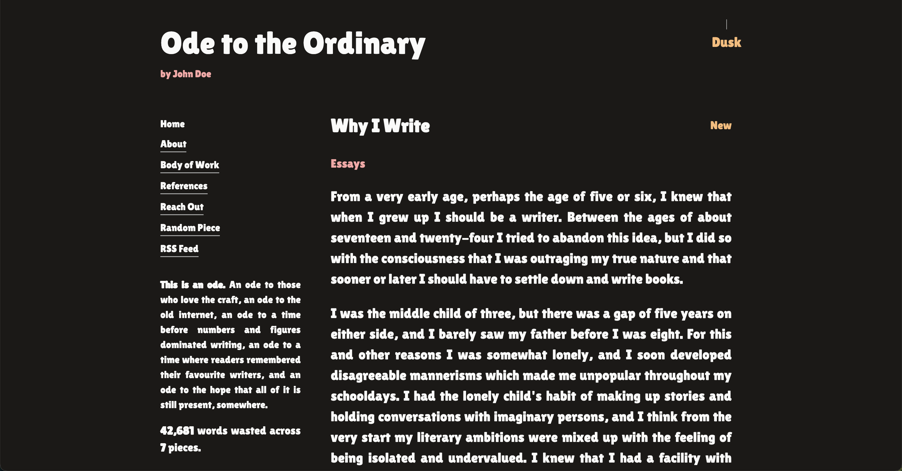
      <p align="center"><strong>comic</strong> - dark</p>
    </td>
  </tr>
  <tr>
    <td width="50%">
      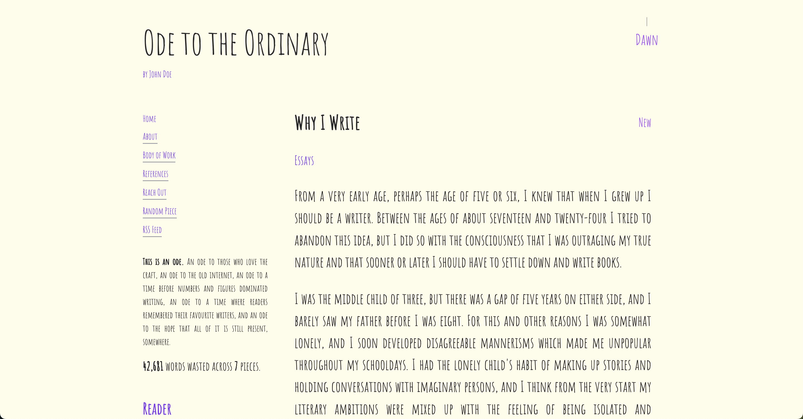
      <p align="center"><strong>doodle</strong> - light</p>
    </td>
    <td width="50%">
      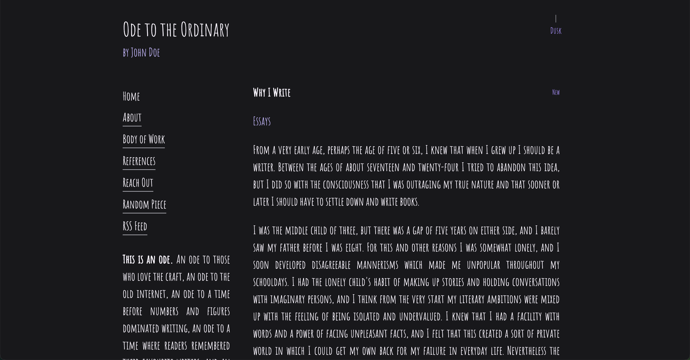
      <p align="center"><strong>doodle</strong> - dark</p>
    </td>
  </tr>
  <tr>
    <td width="50%">
      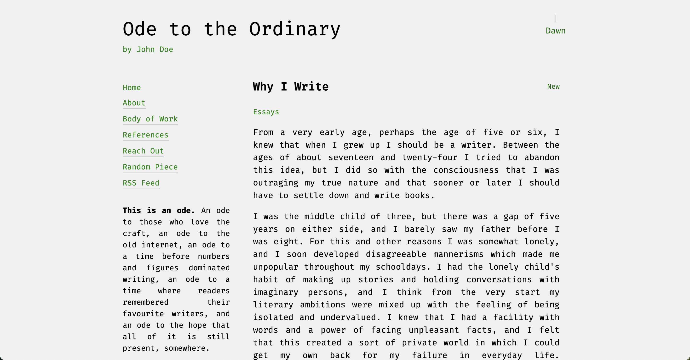
      <p align="center"><strong>exploit</strong> - light</p>
    </td>
    <td width="50%">
      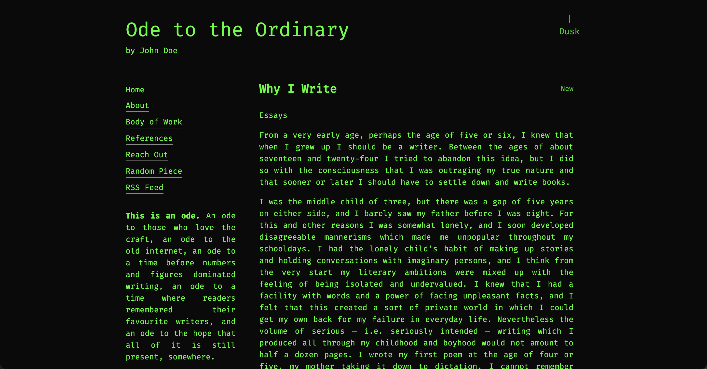
      <p align="center"><strong>exploit</strong> - dark</p>
    </td>
  </tr>
  <tr>
    <td width="50%">
      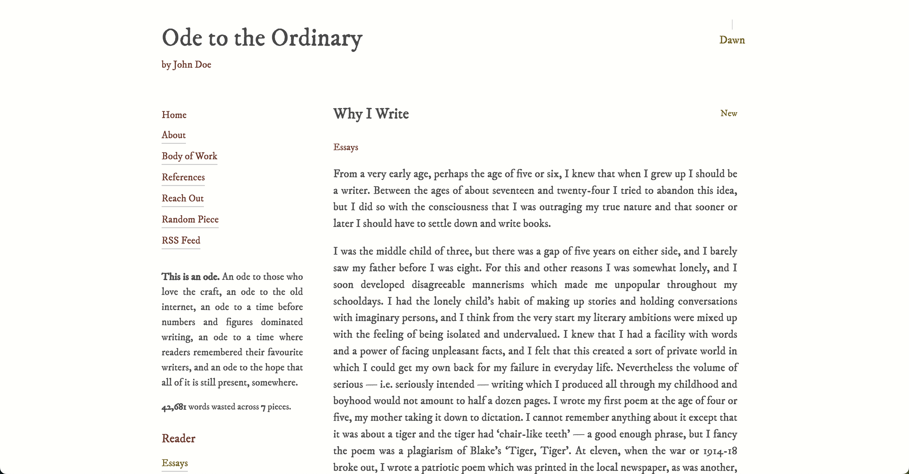
      <p align="center"><strong>journal</strong> - light</p>
    </td>
    <td width="50%">
      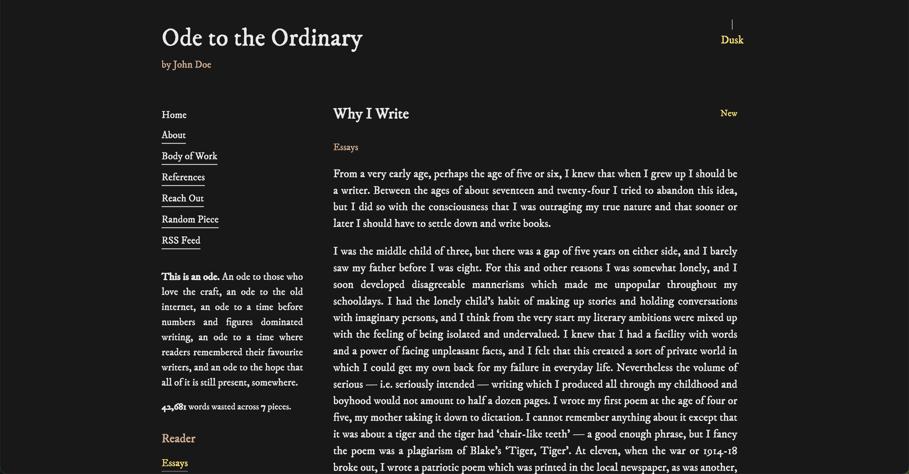
      <p align="center"><strong>journal</strong> - dark</p>
    </td>
  </tr>
  <tr>
    <td width="50%">
      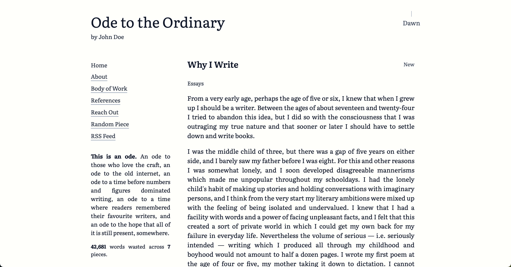
      <p align="center"><strong>manuscript</strong> - light</p>
    </td>
    <td width="50%">
      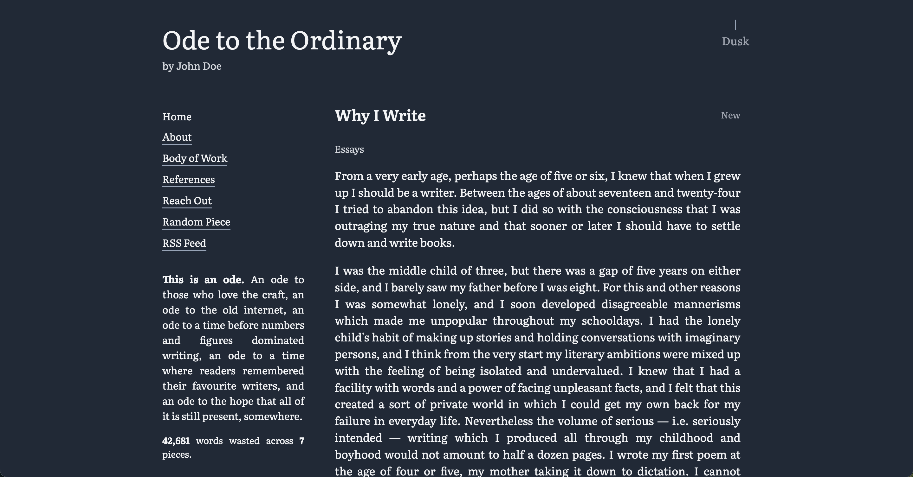
      <p align="center"><strong>manuscript</strong> - dark</p>
    </td>
  </tr>
  <tr>
    <td width="50%">
      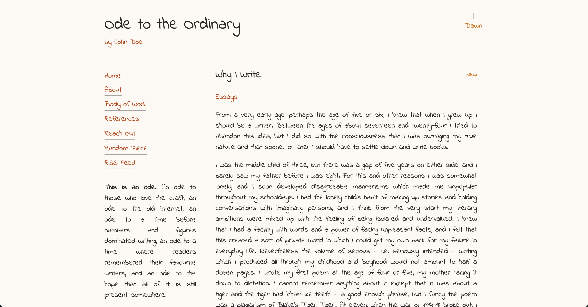
      <p align="center"><strong>recipe</strong> - light</p>
    </td>
    <td width="50%">
      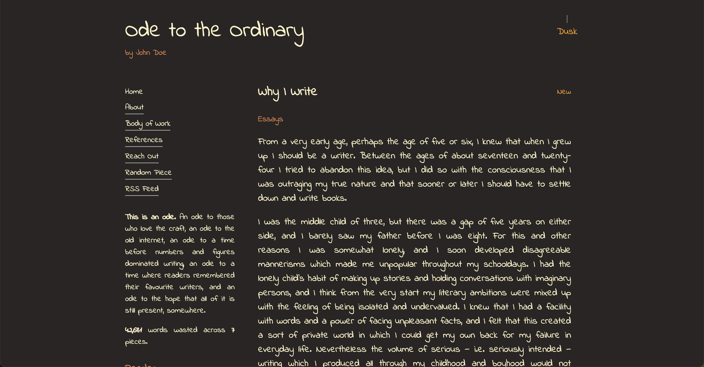
      <p align="center"><strong>recipe</strong> - dark</p>
    </td>
  </tr>
  <tr>
    <td width="50%">
      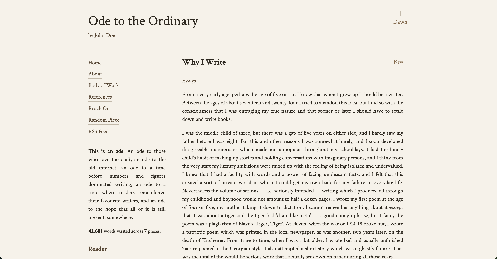
      <p align="center"><strong>scripture</strong> - light</p>
    </td>
    <td width="50%">
      
      <p align="center"><strong>scripture</strong> - dark</p>
    </td>
  </tr>
  <tr>
    <td width="50%">
      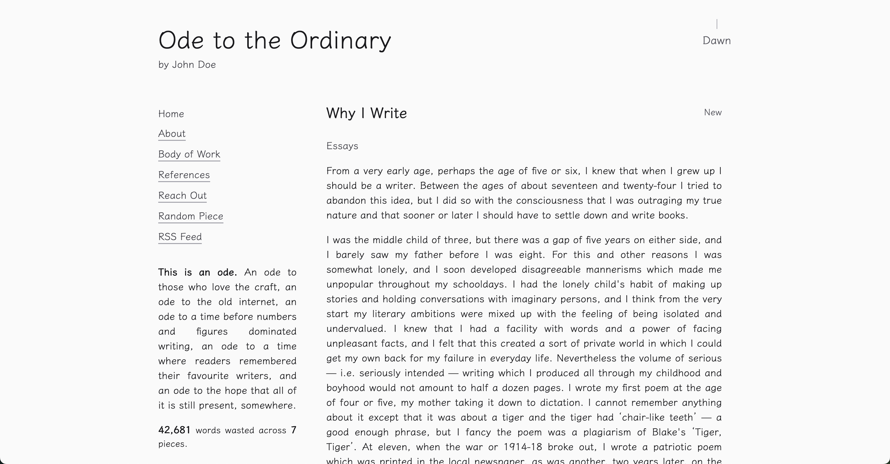
      <p align="center"><strong>sketch</strong> - light</p>
    </td>
    <td width="50%">
      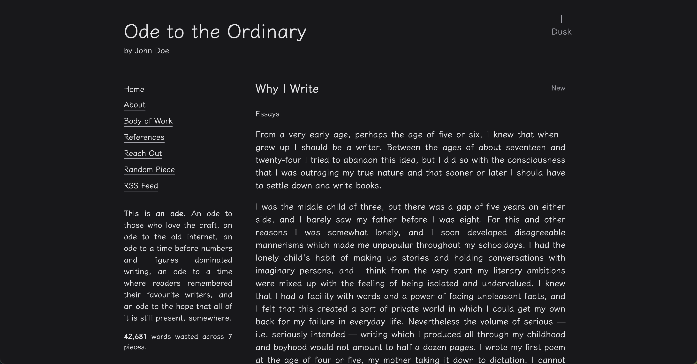
      <p align="center"><strong>sketch</strong> - dark</p>
    </td>
  </tr>
</table>

## Using a Preset

In your `config.yaml`:

```yaml
ui:
  theme:
    preset: "journal"
    defaultMode: "dark"
```

> [!WARNING]  
> The `defaultMode` only applies on first visit. After that, the user's lamp toggle preference is saved.

## Partial Customization

You can override specific parts of a preset theme:

```yaml
ui:
  theme:
    preset: "journal"
    overrides:
      font:
        family: "Lora, serif"
        url: "https://fonts.googleapis.com/css2?family=Lora&display=swap"
      colors:
        light:
          primary: "#8b4513"
          highlight: "#daa520"
        dark:
          background: "#0d0d0d"
```

Only specify what you want to change - everything else comes from the preset.

## Using a Local Font
You can point to font files you host under `public/`. If the `font.url` ends with a font file extension, Ode injects a `@font-face` for you. If it points to a stylesheet (e.g. Google Fonts), Ode adds a `<link>` tag.

Supported local formats: `.woff2`, `.woff`, `.ttf`, `.otf`, `.eot`.

Place files in `public/fonts/` and reference them with `/fonts/...`.

Examples:

- Local WOFF2
```yaml
ui:
  theme:
    preset: manuscript
    overrides:
      font:
        family: "My Headline, sans-serif"
        url: "/fonts/my-headline.woff2"
```

- Local TTF
```yaml
ui:
  theme:
    preset: manuscript
    overrides:
      font:
        family: "My Body, serif"
        url: "/fonts/my-body.ttf"
```

- Google Fonts stylesheet
```yaml
ui:
  theme:
    preset: manuscript
    overrides:
      font:
        family: "Lora, serif"
        url: "https://fonts.googleapis.com/css2?family=Lora&display=swap"
```

### Bundled Local Font Example (Science Gothic)

If you want to bundle a local font with the app, drop the file under `public/fonts/` and reference it directly. For example, with `public/fonts/science-gothic.ttf`:

```yaml
ui:
  theme:
    preset: blueprint
    overrides:
      font:
        family: "Science Gothic, sans-serif"
        url: "/fonts/science-gothic.ttf"
```

Notes:
- The loader detects `.ttf` and injects `@font-face` with `format('truetype')`.
- Keep the family name exactly as you want to use it in CSS (first name before the comma is used for `@font-face`).

## Full Customization

You can define a complete theme in the config without using any preset:

```yaml
ui:
  theme:
    overrides:
      font:
        family: "Playfair Display, serif"
        url: "https://fonts.googleapis.com/css2?family=Playfair+Display:wght@400;700&display=swap"
        fallback: "Georgia, serif"
        scale: 1.2
      colors:
        light:
          primary: "#2c1810"
          secondary: "#4a2c1a"
          grey: "#a8a29e"
          grey2: "#78716c"
          background: "#fffef9"
          text: "#1a1a1a"
          highlight: "#f5e6d3"
        dark:
          primary: "#e6ccb3"
          secondary: "#d4b896"
          grey: "#6b5f52"
          grey2: "#4a3f35"
          background: "#1a1412"
          text: "#f5f5f0"
          highlight: "#2c181040"
```

If you don't specify a `preset`, Ode will fall back to `journal` as the base and apply your overrides.

## Color Properties

Each theme requires these color properties for both light and dark modes:

- **primary** - Main accent color (links, important text)
- **secondary** - Secondary accent color
- **grey** - Lighter gray for borders, dividers
- **grey2** - Darker gray for subtle elements
- **background** - Page background
- **text** - Body text color
- **highlight** - Selection highlight, code blocks

## Font Scale

Some fonts are naturally smaller or larger. Use the `scale` property to adjust:

```yaml
font:
  family: "Reenie Beanie, cursive"
  url: "https://fonts.googleapis.com/css2?family=Reenie+Beanie&display=swap"
  fallback: "sans-serif"
  scale: 1.5
```

## Notes

- Font URLs should point to Google Fonts or a self-hosted font file
- Always include a fallback font family (`serif`, `sans-serif`, or `monospace`)
- Hex colors should include the `#`
- Highlight colors can use transparency with 2-digit alpha: `#ff000040`
- The theme system uses CSS custom properties, so changes apply instantly

That's it. Pick a preset, tweak what you need, or build your own. Make the reading experience truly yours.
